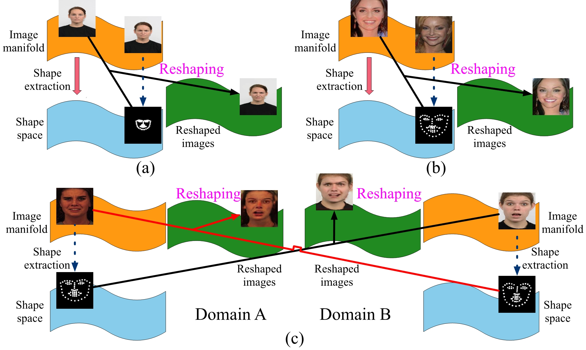
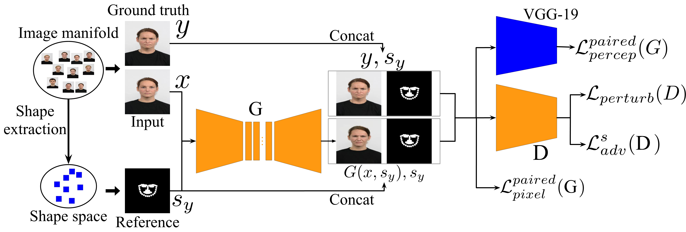
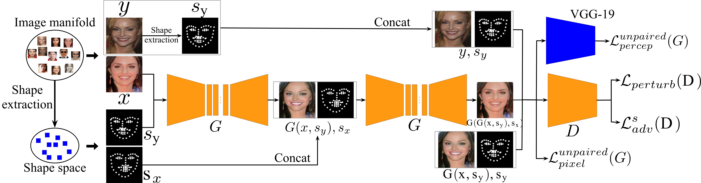
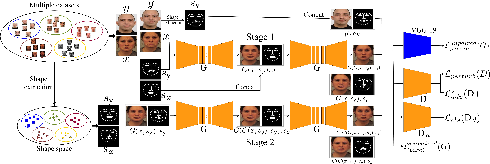
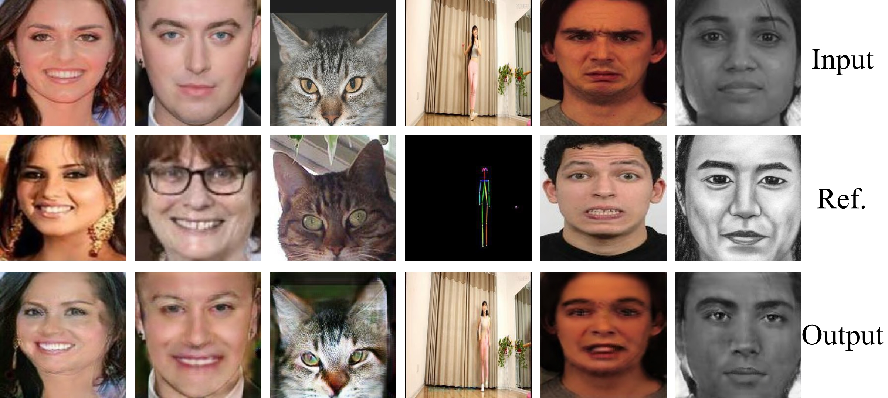
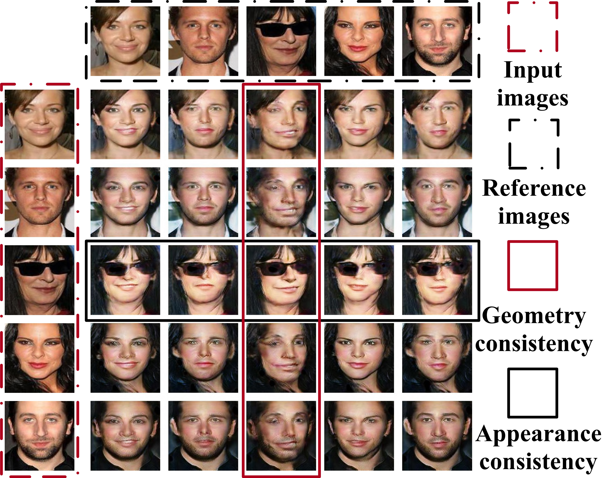
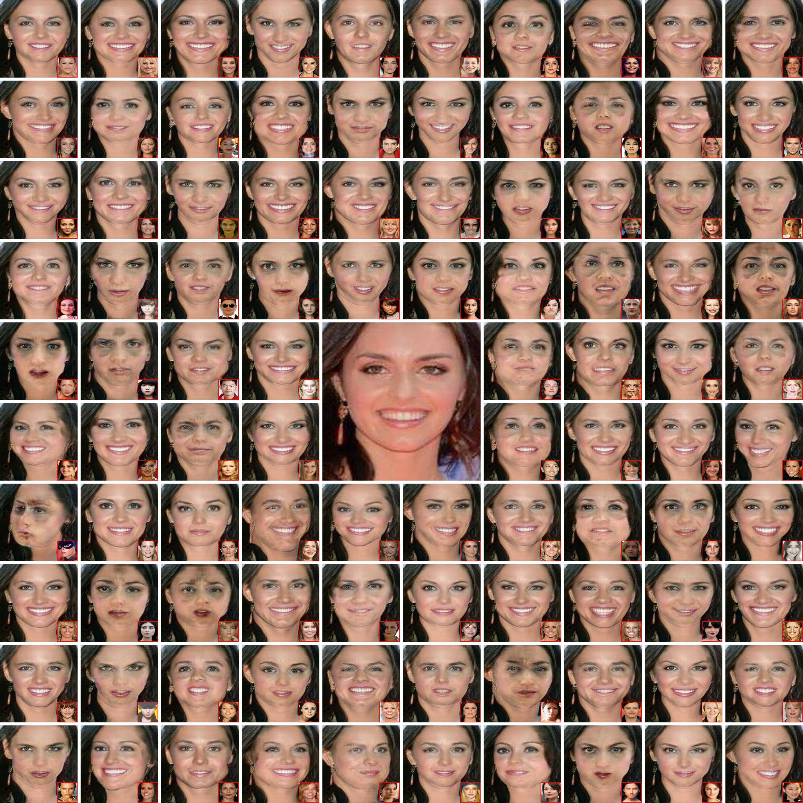
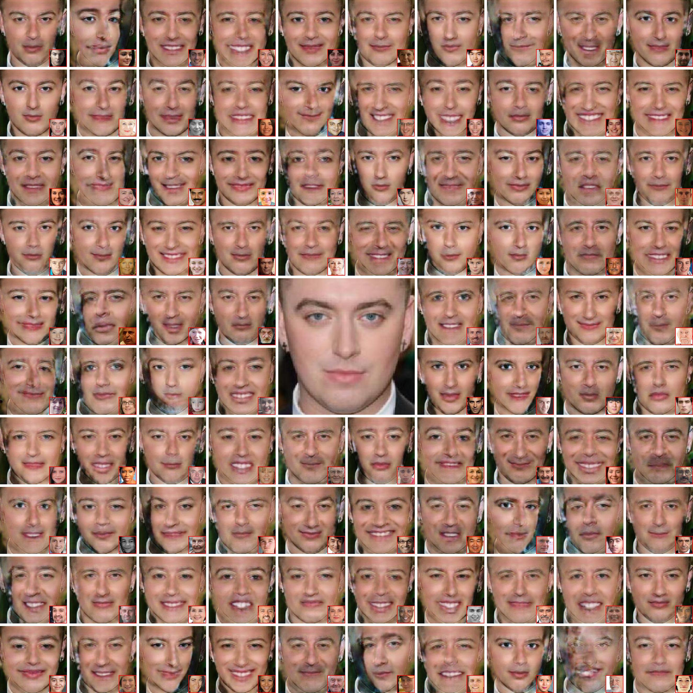
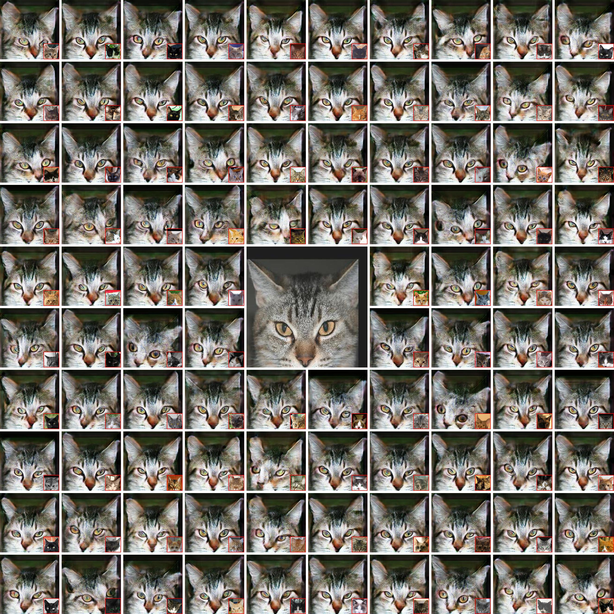
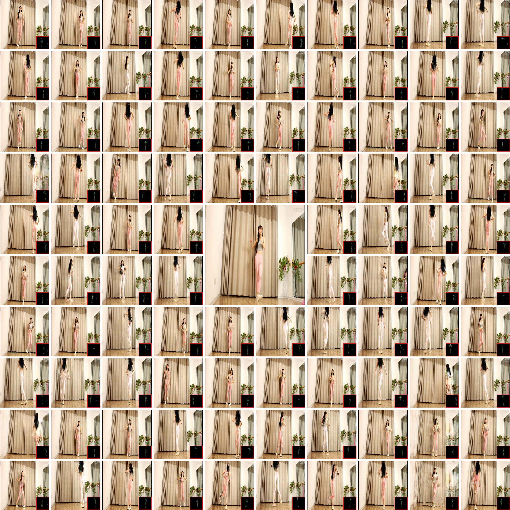

## Introduction
ReshapeGAN is a [Tensorflow](http://tensorflow.org/)-based framework for training and testing of **[ReshapeGAN: Object Reshaping by Providing A Single Reference Image](https://arxiv.org/pdf/1905.06514.pdf)**

The training and testing codes will be released soon!

## Installation
1. We use [Miniconda3](https://conda.io/miniconda.html) for the basic environment. If you installed the Miniconda3 in path `Conda_Path`, please install `tensorflow-gpu` using the command `Conda_Path/bin/conda install -c anaconda tensorflow-gpu==1.8`.
2. Install dependencies by `Conda_Path/bin/pip install -r requirements.txt` (if necessary). The `requirements.txt` file is provided in this package.

## Datasets
Cross-species image-to-image translation datasets: 
- KDEF
- RaFD
- FEI
- CelebA
- UTKFace
- Yale
- WSEFEP
- ADFES
- IIIT-CFW
- PHOTO-SKETCH 
- CUHK
Face Sketch database 

## Data preparation
### Reshaping by within-domain guidance with paired data
```
├── demo
   ├── train
       ├── 000001.jpg 
       ├── 000002.jpg
       └── ...
   ├── test
       ├── a.jpg (The test image that you want)
       ├── b.png
       └── ... 
```
### Reshaping by within-domain guidance with unpaired
data
```
├── demo
   ├── train
       ├── 000001.jpg 
       ├── 000002.jpg
       └── ...
   ├── test
       ├── a.jpg (The test image that you want)
       ├── b.png
       └── ... 
```

### StarGAN
```
├── demo
   ├── train
       ├── 000001.jpg 
       ├── 000002.jpg
       └── ...
   ├── test
       ├── a.jpg (The test image that you want)
       ├── b.png
       └── ...
   ├── attribute.txt (For domain attribute information for training)
   ├── attribute_test.txt (For domain attribute information for training) 
```

## Losses
- `DRAGAN`: [Perturbed loss](https://arxiv.org/abs/1705.07215).
- `LSGAN`: [Least Square GAN](https://arxiv.org/abs/1703.07737).

## Tutorial
### Train
Codes will be released soon!

## ReshapeGAN settings

<div style="text-align: center" />

</div>

## The detailed ReshapeGAN model
### Reshaping by within-domain guidance with paired data
<div style="text-align: center" />

</div>

### Reshaping by within-domain guidance with unpaired data
<div style="text-align: center" />

</div>

### Reshaping by cross-domain guidance with unpaired data
<div style="text-align: center" />

</div>

## Results

<div style="text-align: center" />

</div>


### CelebA
#### The 5 × 5 outputs by our ReshapeGAN using random 5 images as both inputs and references on CelebA dataset. 
<div style="text-align: center" />

</div>

#### Random 96 synthesized images by our ReshapeGAN from one input sample on CelebA dataset. The middle enlarged image shows the input.
<div style="text-align: center" />

</div>


### UTK
#### Random 96 generated results by our ReshapeGAN from one input sample on UTKFace dataset. The middle enlarged image shows the input.
<div style="text-align: center" />

</div>

### cat head 
#### Random 96 synthesized images by our ReshapeGAN from one input sample on Cat head dataset. The middle enlarged image shows the input.
<div style="text-align: center" />

</div>

### Panama 
#### Random 96 synthesized images by our ReshapeGAN from one input sample on Panama dataset. The middle enlarged image shows the input.
<div style="text-align: center" />

</div>

